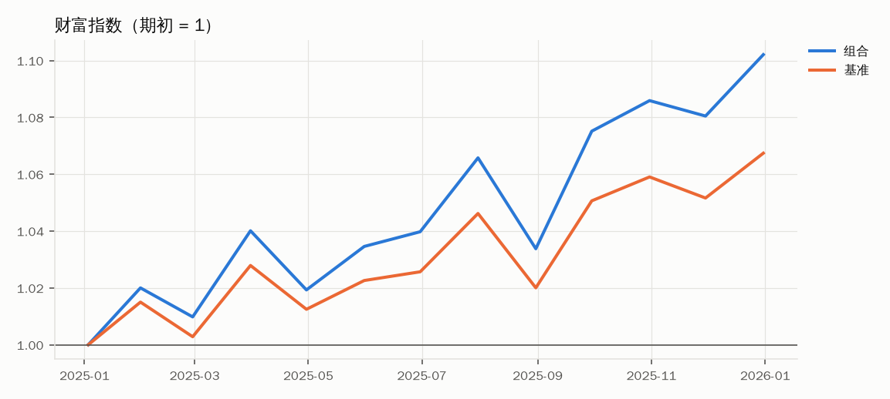
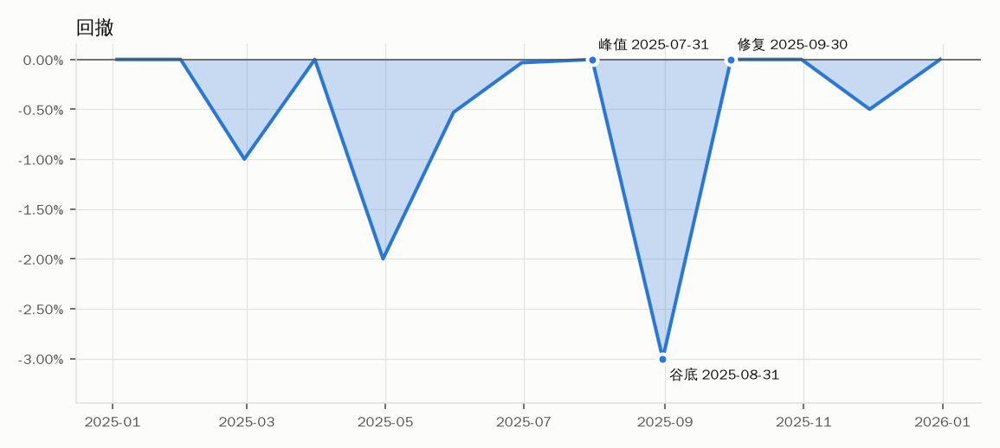

# 正文第九部分演示组合评价报告

## 口径

| 项目 | 内容 |
| --- | --- |
| 样本起 | 2025-01-31 |
| 样本止 | 2025-12-31 |
| 期数 | 12 |
| 样本对齐 | 组合 12 期、基准 12 期、共同 12 期 |
| 频率 K | 月度，K = 12 |
| 组合 | 演示组合（正文第九部分） |
| 基准 | 演示基准（正文第九部分） |
| 基准收益类型 | 未说明 |
| 市场代理 | 以基准代替 |
| 无风险收益 | 每月 0.15%（正文第九部分） |
| 费用口径 | 费用后净值 |
| 比率口径 | 同频算术均值与样本标准差（n−1），乘以 √K 年化；累计与年化收益为几何口径 |

## 收益表现

| 指标 | 数值 | 口径说明 |
| --- | --- | --- |
| 累计收益（组合） | 10.2058% | 几何连乘 ∏(1 + r) − 1 |
| 年化收益（组合） | 10.2058% | 几何年化，T = n / K = 12/12 |
| 累计收益（基准） | 6.7390% | 几何连乘 |
| 年化收益（基准） | 6.7390% | 几何年化 |
| 累计收益差额 | 3.4667 个百分点 | R_p − R_b |
| 几何相对收益 | 3.2479% | (1 + R_p) / (1 + R_b) − 1 |

## 风险效率

| 指标 | 数值 | 口径说明 |
| --- | --- | --- |
| 年化波动率 | 7.2864% | 样本标准差 × √K |
| 最大回撤 | 3.0000% | 按月度数据计算，峰值含期初 |
| 回撤峰值日期 | 2025-07-31 |  |
| 回撤谷底日期 | 2025-08-31 |  |
| 修复日期 | 2025-09-30 | 财富指数回到前高的首期 |
| 回撤期数（峰值至谷底） | 1 |  |
| 修复期数（谷底至修复） | 1 | 未修复时不适用 |
| Sharpe 比率 | 1.1254 | 年化：超额收益算术均值 / 样本标准差 × √K |
| 跟踪误差 TE | 1.4780% | 年化：主动收益样本标准差 × √K |
| 信息比率 IR | 2.2327 | 年化：主动收益算术均值 / TE |
| Treynor 比率 | 6.6923% | K × 超额收益均值 / β；以基准代替市场 |
| M² | 8.4668% | 年化算术口径，按基准波动率调整 |
| M² 差额 | 1.7668 个百分点 | M² − 基准年化算术均值 |

## 下行与尾部

| 指标 | 数值 | 口径说明 |
| --- | --- | --- |
| 下行偏差（年化） | 4.0361% | 每期下行偏差 × √K，分母为全样本 n；MAR = 无风险收益（未单独指定） |
| Sortino 比率 | 2.0317 | 年化；MAR = 无风险收益（未单独指定） |
| Calmar 比率 | 3.4019 | 几何年化收益 / 最大回撤 |
| 历史 VaR（95%） | 3.0000% | 历史模拟，单期损失以正数报告；尾部观测 0.6 个（少于 5 个，样本过小，仅供参考） |
| 历史 ES（95%） | 3.0000% | 历史模拟，单期损失以正数报告；尾部观测 0.6 个（少于 5 个，样本过小，仅供参考） |

## Alpha 质量

| 指标 | 数值 | 口径说明 |
| --- | --- | --- |
| CAPM Alpha（每期） | 0.1830% | 截距，月度；以基准代替市场 |
| CAPM Alpha（算术年化） | 2.1961% | α × K，算术口径 |
| Alpha t 值 | 3.1992 | OLS（t 分布） |
| Alpha p 值 | 0.0095 | 双侧 |
| Alpha 95% 置信下限（每期） | 0.0555% |  |
| Alpha 95% 置信上限（每期） | 0.3105% |  |
| CAPM Beta | 1.2253 |  |
| R² | 0.9924 |  |
| 回归样本期数 n | 12 |  |
| 是否 HAC | 否 | OLS（t 分布） |
| TM 择时 γ | -0.9473 | TM：x² 系数 |
| TM γ t 值 | -0.4133 | OLS（t 分布） |
| HM 择时 γ | -0.0715 | HM：max(x, 0) 系数 |
| HM γ t 值 | -0.4832 | OLS（t 分布） |

## 回归系数

系数为每期值，与输入收益同频。

| 模型 | 系数 | 估计值 | 标准误 | t | p | 95% 下限 | 95% 上限 | R² | n | 标准误类型 |
| --- | --- | --- | --- | --- | --- | --- | --- | --- | --- | --- |
| CAPM | alpha | 0.001830 | 0.000572 | 3.1992 | 0.0095 | 0.000555 | 0.003105 | 0.9924 | 12 | OLS（t 分布） |
| CAPM | market | 1.225293 | 0.033900 | 36.1446 | 0.0000 | 1.149760 | 1.300827 | 0.9924 | 12 | OLS（t 分布） |
| Treynor–Mazuy | alpha | 0.002090 | 0.000867 | 2.4095 | 0.0393 | 0.000128 | 0.004052 | 0.9925 | 12 | OLS（t 分布） |
| Treynor–Mazuy | beta | 1.227691 | 0.035871 | 34.2249 | 0.0000 | 1.146544 | 1.308838 | 0.9925 | 12 | OLS（t 分布） |
| Treynor–Mazuy | gamma | -0.947273 | 2.291908 | -0.4133 | 0.6891 | -6.131930 | 4.237385 | 0.9925 | 12 | OLS（t 分布） |
| Henriksson–Merton | alpha | 0.002353 | 0.001236 | 1.9045 | 0.0892 | -0.000442 | 0.005148 | 0.9926 | 12 | OLS（t 分布） |
| Henriksson–Merton | beta | 1.263595 | 0.086765 | 14.5635 | 0.0000 | 1.067320 | 1.459870 | 0.9926 | 12 | OLS（t 分布） |
| Henriksson–Merton | gamma | -0.071532 | 0.148041 | -0.4832 | 0.6405 | -0.406423 | 0.263360 | 0.9926 | 12 | OLS（t 分布） |

## 稳健性：剔除异常期

无异常期，未做剔除。

## 图表

- 未生成“滚动 12 期超额收益与跟踪误差”：样本 12 期，等于滚动窗口 12 期，只有 1 个窗口，画不出滚动曲线（至少需要 13 期）

## 数据质量

| 项目 | 结果 |
| --- | --- |
| 样本起 | 2025-01-31 |
| 样本止 | 2025-12-31 |
| 期数 | 12 |
| 样本长度（不少于 36 期） | 样本较短，统计推断与能力判断受限 |
| 缺失期数（portfolio） | 0 |
| 缺失期数（benchmark） | 0 |
| 异常收益（稳健 z 值） | 0 |
| 疑似停牌或估值滞后区间 | 0 |
| 净值与日增长率交叉核对 | 未提供核对数据 |

- 样本较短（12 期，月度少于 36 期，即不足 3 年），统计推断与能力判断受限

## 附注

- Sortino 的 MAR 未单独指定，取无风险收益；正文要求 MAR 事前约定。
- 历史 VaR / ES 的尾部观测只有 0.6 个，样本过小，结果仅供参考。
- 未提供市场收益，Treynor、CAPM 与择时回归以基准代替市场。

## 结论

观察到的表现：样本为 2025-01-31 至 2025-12-31 的 12 期月度数据（约 1.0 年，费用后净值）。组合累计收益 10.21%（几何），年化收益 10.21%（几何年化）；基准累计收益 6.74%，累计收益差额 3.47 个百分点，几何相对收益 3.25%。年化波动率 7.29%，最大回撤 3.00%（2025-07-31 至 2025-08-31，于 2025-09-30 修复）；Sharpe 比率 1.13（年化，算术均值口径），信息比率 2.23，跟踪误差 1.48%（年化），M² 8.47%（年化算术），较基准年化算术均值高 1.77 个百分点。

可以支持的解释：CAPM 回归的 Alpha 为每期 0.183%（算术年化 2.20%），t = 3.20，p = 0.010，n = 12，OLS（t 分布），在大样本 5% 双侧口径下提供初步统计支持（|t| ≥ 1.96 只是参考，实际阈值须结合自由度与多重比较调整）。样本较短（12 期，不足 36 个月），只能说观察到模型未解释的收益，尚不足以据此评价经理的管理能力。Treynor–Mazuy 择时 γ = -0.947（t = -0.41，OLS（t 分布）），未显著偏离零（|t| < 1.96）；Henriksson–Merton 择时 γ = -0.072（t = -0.48，OLS（t 分布）），未显著偏离零（|t| < 1.96）。下行风险方面，Sortino 比率 2.03（年化），Calmar 比率 3.40（几何年化收益 / 最大回撤）。

需要进一步验证的判断：以下检验未做：风格分析（第五部分第 1 节）；多因子分解（第五部分第 3 节）；Brinson 归因（第五部分第 2 节）；样本外检验（第四部分第 3 节）；扣费后净 Alpha（第六部分）；交易容量（第六部分）；资金加权收益 MWR（第二部分）；持续监控分区（第七部分）。收益是否来自风格暴露、因子溢价或费用前后差异，需补做后再下结论。稳健性（剔除异常期）：无异常期，未做剔除。历史 VaR 3.00%、ES 3.00%（95%，单期损失），尾部观测过少，仅供参考。数据质量检查未发现缺失、异常收益或疑似停牌。样本较短，应在更长样本与样本外区间重复检验，结果才可能稳定。

## 未完成的检验

| 检验 | 状态 | 原因 |
| --- | --- | --- |
| 风格分析（第五部分第 1 节） | 未做 | 未提供风格指数收益（CLI 用 --style，Python 用 style_returns） |
| 多因子分解（第五部分第 3 节） | 未做 | 未提供因子收益（CLI 用 --factors cn_index_proxy / cn_index_proxy4 / ff3_us / carhart_us，Python 用 factor_returns） |
| Brinson 归因（第五部分第 2 节） | 未做 | 需要持仓与行业权重；持仓齐备后可用 fundeval.attribution.brinson |
| 样本外检验（第四部分第 3 节） | 未做 | 报告只做全样本估计；样本外须事前规定切分点（alpha.rolling.split_in_out_of_sample） |
| 扣费后净 Alpha（第六部分） | 未做 | 当前为费用后净值；未给出换手率与成本（Python 用 costs，见 fundeval.costs） |
| 交易容量（第六部分） | 未做 | 需要持仓交易金额与日均成交额（costs['capacity']，见 costs.capacity_check） |
| 资金加权收益 MWR（第二部分） | 未做 | 需要申购赎回现金流 |
| 持续监控分区（第七部分） | 未做 | 未给出目标主动收益、目标 TE 与窗口 |
