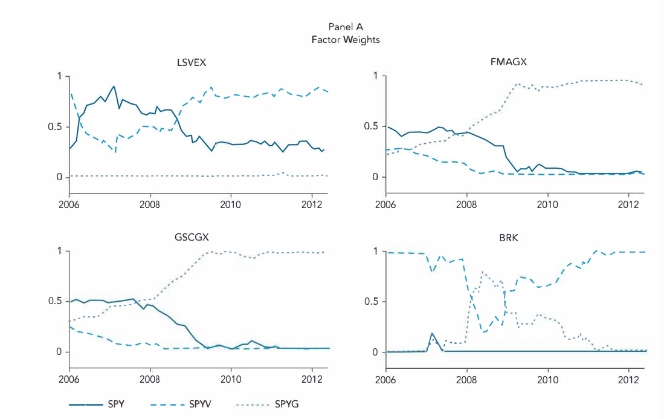

# 投资组合绩效评估

评价框架 计算方法 收益归因与风险监控

投资组合绩效评估的核心，是判断收益是否足以补偿所承担的风险，以及超额收益能否在扣除成本后持续实现。评价应先统一数据和基准，再依次检查收益表现、风险效率、收益来源、Alpha 证据、执行成本与风险偏离。单一高收益或单次正 Alpha，均不足以证明管理能力。

## 一 评价框架与数据准备

| 评价维度 | 需要回答的问题 | 主要证据 |
| --- | --- | --- |
| 收益表现 | 获得多少收益，是否超过基准 | 累计收益、年化收益、TWR、MWR |
| 风险效率 | 承担的风险是否获得合理补偿 | 波动率、回撤、Sharpe、IR |
| 收益来源 | 收益由哪些投资决策产生 | 风格分析、Brinson、多因子、Campisi |
| Alpha 质量 | 超额收益是否稳定且有统计支持 | IC、有效广度、t 检验、滚动与样本外检验 |
| 成本与容量 | 账面优势能否实际兑现 | 换手率、费用、冲击成本、交易容量 |
| 持续监控 | 风险与业绩是否偏离预算 | 跟踪误差、预警区间、VaR、ES |

### 1 先确定可比较的评价口径

评价前固定样本起止日、计价币种、收益频率、业绩基准、无风险收益和费用口径。组合与基准应覆盖同一期间，并使用包含分红或利息再投资的总收益口径。基准须与投资授权和可投资范围匹配，避免事后挑选更容易战胜的指数。

### 2 建立最小数据集

基础层收集日期、复权净值或总收益率、基准总收益、无风险收益、申购赎回及其日期。归因层增加期初持仓权重、行业分类、个券收益、因子暴露和债券久期等数据。执行层增加成交金额、成交价格、费用、点差及资产成交量。

清洗顺序为日期对齐、币种统一、现金流识别、缺失与异常复核、收益计算。停牌或估值滞后不能直接当作低风险证据；组合和基准不同交易日的缺失值也不应机械填零。

记号约定：p 为组合，b 为基准，m 为市场，f 为无风险资产；t 为观测期，n 为样本期数，K 为一年期数（月度取 12，日度按统一交易日约定）。百分比表示收益率，百分点表示两项收益率之差，1 bp = 0.01 个百分点。

## 二 收益衡量与计算口径

### 1 先计算单期收益

若使用已正确复权的单位净值，单期收益等于本期净值除以上期净值再减一。若使用未复权价格，应单独计入分红或利息，避免漏计收益或重复计入现金分配。

$$
r_{p,t} = \frac{\mathrm{NAV}_{t}}{\mathrm{NAV}_{t-1}} - 1
$$

若使用账户资产价值，必须剔除申购赎回等外部现金流。下式 NCF 以流入账户为正，仅适用于现金流发生在期末的情形；期中大额现金流应按现金流发生时点拆分子期。

$$
r_t = \frac{V_t - \mathrm{NCF}_t}{V_{t-1}} - 1
$$

### 2 时间加权收益衡量组合管理表现

TWR 将各无外部现金流子期的收益率几何连接，用于尽量排除客户投入或撤出资金时点的影响。累计收益不取 n 次根；开方或幂运算用于计算几何平均或年化收益。[1]

$$
R_{\mathrm{TWR}} = \prod_{j=1}^{n}(1+r_j) - 1
$$

$$
R_{\mathrm{ann}} = (1+R_{\mathrm{TWR}})^{\frac{1}{T}} - 1
$$

T 为评价区间的年数。若使用 n 个等长观测期，则 T = n/K；若按现金流拆成不等长子期，不得用子期个数直接年化。不足一年的结果宜优先报告实际区间收益。

演示：期初投入 100，第一年末变为 110；随后追加 50，第二年末资产为 144。两年子期收益分别为 10% 和 −10%，TWR 累计收益为 1.10 × 0.90 − 1 = −1.00%，年化约为 −0.50%。资产终值增加不代表投资盈利。

### 3 资金加权收益衡量投资者的实际资金体验

MWR 通常以内部收益率 IRR 表示。按投资者视角，投入为负、收回为正；将期末剩余资产作为最后一笔正现金流，求使净现值为零的收益率。不规则日期使用 XIRR。[1]

$$
0 = \sum_{j=0}^{N}\frac{\mathrm{CF}_j}{(1+i)^{\frac{d_j-d_0}{365}}}
$$

上例若两个间隔均为整年，则求解 −100 − 50 ÷ (1 + i) + 144 ÷ (1 + i)² = 0，得到资金加权年化收益约 −2.42%。它与时间加权收益的差异来自资金投入时点和金额，不能据此直接评价经理优劣。

### 4 区分两种超额收益

累计收益差额为组合累计收益减去基准累计收益，单位为百分点；几何相对收益为两者财富增长倍数之比再减一。两者含义不同，报告应注明口径。单期主动收益定义为组合收益减去同期基准收益，供跟踪误差和信息比率使用。

$$
a_t = r_{p,t}-r_{b,t}; \qquad R_{\mathrm{rel}} = \frac{1+R_p}{1+R_b}-1
$$

## 三 风险调整后的绩效衡量

总风险指标用于评价整体资金体验，主动风险指标用于评价相对基准的管理效率。比率计算采用同频收益的算术均值和样本标准差；报告年化累计收益时采用几何口径，二者不能混用。[2]

### 1 波动率与最大回撤

$$
\sigma_{\mathrm{ann}} = s(r_{p,t})\sqrt{K}; \qquad \mathrm{MDD} = \max_t\left(1-\frac{W_t}{\max_{s\le t}W_s}\right)
$$

W 是从 1 开始累计连乘得到的财富指数，历史最高值须包含初始值 1。最大回撤以正的损失幅度报告。日度与月度观察得到的最大回撤可能不同，必须披露观察频率。

### 2 夏普比率与信息比率

$$
e_t = r_{p,t}-r_{f,t}; \qquad \mathrm{Sharpe}_{\mathrm{ann}} = \frac{\bar{e}}{s(e)}\sqrt{K}
$$

$$
\mathrm{TE}_{\mathrm{ann}} = s(a_t)\sqrt{K}; \qquad \mathrm{IR}_{\mathrm{ann}} = \frac{\bar{a}}{s(a)}\sqrt{K}
$$

Sharpe 衡量单位超额收益波动对应的收益，本文分母采用组合减无风险收益的标准差；无风险收益固定时，它等于组合收益波动率。IR 衡量单位主动风险对应的主动收益。基准选择会直接影响 IR 的解释；TE 越低并不一定越好，应对照目标主动风险。

### 3 市场风险与风险匹配后的收益

$$
\mathrm{Treynor}_{\mathrm{ann}} = \frac{K\bar{e}}{\beta_p}; \qquad \hat{\alpha} = \overline{r_p-r_f} - \hat{\beta}\,\overline{r_m-r_f}
$$

Treynor 适用于已充分分散、市场 Beta 有经济含义的组合；Beta 接近零或为负时不宜机械排名。Jensen Alpha 的稳定性和显著性应通过收益回归估计，不能只凭单期残差判断能力。

$$
M^2 = \mu_f + \frac{\sigma_b}{\sigma_p}(\mu_p-\mu_f); \qquad M^2\text{差额} = M^2-\mu_b
$$

M² 将组合调整到基准波动率后比较收益。这里 μ 为年化算术均值，σ 为年化波动率；无风险收益视为稳定。M² 收益与 M² 相对基准差额应分开报告，不能都写成同一个“收益率”。

| 指标 | 主要用途 | 需要同时披露 |
| --- | --- | --- |
| Sharpe | 绝对收益效率 | 无风险口径、样本期、收益频率 |
| IR 与 TE | 主动管理效率及风险预算 | 基准、目标 TE、费用口径 |
| MDD | 历史最严重资金回撤 | 观察频率、发生时段、修复时间 |
| Treynor 与 Alpha | 市场风险调整 | 市场代理、Beta 估计与模型设定 |

平方根年化依赖收益相关结构足够稳定等近似条件。存在自相关、估值平滑或显著非线性敞口时，应补充稳健估计和情景分析。比率分母为零时报告不适用。

## 四 Alpha 来源与能力判断

Alpha 是相对于特定模型的未解释收益，不是管理能力的直接标签。评价需要同时回答：是否控制了主要风险暴露、结果是否稳定、统计证据是否充分，以及扣费后是否仍有经济意义。

### 1 用 IC 和有效广度理解优势来源

$$
\mathrm{IR} \approx \mathrm{IC}\times\sqrt{\mathrm{BR}}; \qquad \mathrm{IR} \approx \mathrm{TC}\times\mathrm{IC}\times\sqrt{\mathrm{BR}}
$$

主动管理基本定律把预期主动管理效率与预测质量和有效独立决策广度联系起来。IC 表示预测与随后实现收益的相关性；BR 是同一评价期间内有效独立投资决策的数量；TC 表示在约束下将预测转化为组合头寸的效率。该关系依赖模型假设，适合解释来源，不能代替实测 IR。[3]

例如 IC 为 0.05、年度有效广度为 100 时，理想化预期 IR 约为 0.50；若 TC 为 0.70，则约为 0.35。高换手并不自动意味着高 BR：重复交易高度相关的股票或因子，可能增加成本却没有增加有效信息。

### 2 通过回归估计 Alpha 与统计不确定性

$$
r_{p,t}-r_{f,t} = \alpha + \sum_{k=1}^{q}\beta_k F_{k,t} + \varepsilon_t
$$

$$
t_{\alpha} = \frac{\hat{\alpha}}{\mathrm{SE}(\hat{\alpha})}
$$

先选与策略匹配的风险因子，估计截距和系数，再报告 Alpha、标准误、t 值、置信区间及样本长度。收益存在异方差或自相关时，可采用 Newey–West 等 HAC 稳健标准误，并说明滞后阶数。

大样本下，双侧 5% 检验常以 |t| 约 1.96 为参考，但实际阈值应结合自由度、检验假设和多重比较调整确定。正且显著的 Alpha 支持模型下存在正截距，不足以排除模型遗漏、样本偏差或运气。负的显著 Alpha 则提示可能存在持续落后。

### 3 按证据强度完成交叉验证

| 检验 | 操作方法 | 判断重点 |
| --- | --- | --- |
| 稳定性 | 滚动估计 Alpha、Beta、IR | 优势是否集中于少数月份或特定市场 |
| 稳健性 | 合理替换基准、窗口及因子 | 结论是否依赖单一设定 |
| 样本外 | 按时间顺序留出验证期 | 策略形成后的实际有效性 |
| 偏差控制 | 处理幸存者、前视及多重检验 | 是否挑中了事后最优结果 |
| 经济意义 | 检查扣费后收益和风险预算 | 即使显著，金额是否值得承担风险 |

最终表述应与证据相匹配。短期正 Alpha 可描述为“观察到模型未解释的正收益”；只有在较长样本、多市场环境、样本外与扣费检验一致时，才能形成更强的管理能力判断。

## 五 风格分析与收益归因

### 1 Sharpe 风格分析识别收益暴露

收益型风格分析使用基金收益对一组资产类别或风格指数进行约束拟合，回答“该组合的收益变化更像哪些市场或风格”。典型长期多头设定要求权重非负、权重之和为 1；以解释收益波动为目标时，可通过最小化残差方差估计权重。[4]

$$
r_{p,t} = \alpha + \sum_{k=1}^{q}w_k r_{k,t} + \varepsilon_t; \qquad \sum_{k=1}^{q}w_k = 1, \quad w_k \ge 0
$$

计算时，先统一组合与指数的总收益口径，再选定窗口并拟合非负权重，输出拟合优度、残差和滚动权重。风格权重是统计估计，不等同于实际持仓；残差均值也不能直接视为扣除一切风险后的真实选股能力。

原案例选用 SPY、SPYV、SPYG，分别代表广义大盘市场、价值和成长暴露。这三者有较高重叠，不构成互斥类别；共线性会使权重解释不稳定。实际应用宜选择覆盖完整且尽量低冗余的风格基准，并检查替换基准后的稳健性。

图 1  原案例的滚动风格权重示意  图像沿用原文

从图示看，LSVEX 的价值暴露较突出；FMAGX 和 GSCGX 的成长暴露在后段上升；BRK 的估计风格暴露在危机阶段发生明显变化。这些现象用于提示进一步检查持仓、投资授权和估计窗口，不能据此断言经理主动完成了某种风格切换。

案例边界：图示年份约为 2006—2012 年，收益频率、滚动窗口、费用口径和原始数据来源未标注。BRK 为伯克希尔相关证券案例，不与共同基金直接作无条件排名；证券类别亦应核实。该图仅用于方法解读。

### 2 Brinson 归因区分配置与选择

Brinson 将单期组合相对基准的收益差额，拆分为行业配置、行业内选择和交互效应。以下使用 Brinson–Hood–Beebower 三项分解，组合与基准权重均应加总为 1，现金也应纳入一致分类。

$$
A_i = (w_{p,i}-w_{b,i})r_{b,i}
$$

$$
S_i = w_{b,i}(r_{p,i}-r_{b,i})
$$

$$
I_i = (w_{p,i}-w_{b,i})(r_{p,i}-r_{b,i})
$$

$$
r_p-r_b = \sum_i(A_i+S_i+I_i)
$$

配置效应反映增减行业权重的贡献；选择效应反映行业内部相对收益的贡献；交互效应反映主动权重与行业内相对收益共同作用。Brinson–Fachler 版本的配置项会将行业基准收益减去整体基准收益；在完整权重下总配置贡献一致，但行业分配不同，应标明版本。

### 单期演示与第九部分第一个月衔接

| 行业 | 组合权重 | 基准权重 | 组合行业收益 | 基准行业收益 |
| --- | --- | --- | --- | --- |
| 甲 | 50% | 40% | 3.8% | 3.0% |
| 乙 | 30% | 40% | 1.0% | 1.0% |
| 丙 | 20% | 20% | −1.0% | −0.5% |

第一步，按期初权重加权：组合收益为 50% × 3.8% + 30% × 1.0% + 20% × (−1.0%) = 2.00%；基准收益为 1.50%，主动收益为 0.50 个百分点。

| 行业 | 配置贡献 | 选择贡献 | 交互贡献 | 合计 |
| --- | --- | --- | --- | --- |
| 甲 | 0.30 | 0.32 | 0.08 | 0.70 |
| 乙 | −0.10 | 0.00 | 0.00 | −0.10 |
| 丙 | 0.00 | −0.10 | 0.00 | −0.10 |
| 总计 | 0.20 | 0.22 | 0.08 | 0.50 |

表中贡献单位均为百分点；行业收益与权重均为演示数据。

第二步，以甲行业为例：配置贡献为 (50% − 40%) × 3.0% = 0.30 个百分点；选择贡献为 40% × (3.8% − 3.0%) = 0.32 个百分点；交互贡献为 0.08 个百分点。

第三步，检查 0.20 + 0.22 + 0.08 = 0.50 个百分点，须与组合减基准完全对账。本例选择与配置均有正贡献，交互效应进一步增强收益，但一个月的结果不足以证明稳定能力。

执行时需使用与收益区间一致的期初权重或交易层归因。存在期内交易、费用和外部资金流时，应明确处理方法。跨期归因不能直接把各期贡献相加，应采用明确的多期链接方法并对账累计超额收益。

### 3 多因子模型分离共同风险与剩余收益

多因子分析用于判断收益是否主要来自市场、规模、价值、动量等共同暴露。收益时间序列回归与 Barra 类持仓风险模型应区分使用：前者从历史收益估计 Beta 和截距，后者通常使用个券暴露、因子收益和特异收益进行组合层分解。

$$
r_{p,t}-r_{f,t} = \alpha + \beta\,\mathrm{MKT}_t + s\,\mathrm{SMB}_t + h\,\mathrm{HML}_t + u\,\mathrm{UMD}_t + \varepsilon_t
$$

MKT 为市场超额收益，SMB 为小盘相对大盘因子，HML 为价值相对成长因子，UMD 为动量因子。计算时对齐同一市场、币种、日期与收益频率，估计系数和稳健标准误，检查残差及拟合优度，再比较不同窗口下的稳定性。因子定义和市场覆盖范围也须记录。[5]

### 原文四因子表的规范解读

| 系数及 t 值 | LSVEX | FMAGX | GSCGX | BRK |
| --- | --- | --- | --- | --- |
| Alpha | 0.00% | −0.27% | −0.14% | 0.22% |
| t Alpha | 0.01 | −2.23 | −1.33 | 0.57 |
| MKT | 0.94 | 1.12 | 1.04 | 0.36 |
| t MKT | 36.9 | 38.6 | 42.2 | 3.77 |
| SMB | 0.01 | −0.07 | −0.12 | −0.15 |
| t SMB | 0.21 | −1.44 | −3.05 | −0.97 |
| HML | 0.51 | −0.05 | −0.17 | 0.34 |
| t HML | 14.6 | −1.36 | −4.95 | 2.57 |
| UMD | 0.20 | 0.02 | 0.00 | −0.06 |
| t UMD | 1.07 | 1.00 | −0.17 | −0.77 |

以上数值转录自原文图表。回归样本、Alpha 频率、费用及标准误口径未标明，因此保留原始单位，不将 Alpha 年化，也不作为当前基金绩效结论。

LSVEX 的 HML 系数为 0.51，t 值为 14.6，支持该样本下存在较明显的价值暴露。GSCGX 的 HML 和 SMB 均为负且 t 值绝对值较大，提示偏成长、偏大盘的收益特征。

FMAGX 的 Alpha 为负，t 值为 −2.23，在通常的大样本双侧检验口径下提供负截距的初步证据；其余三个 Alpha 的 t 值不足以支持显著偏离零。仍需补充样本信息、稳健标准误和多重检验处理。

市场 Beta 高于 1 表示市场敏感度较高，不能单凭这一点认定使用杠杆；BRK 的市场 Beta 为 0.36 且 t 值为 3.77，也不能解释为“与市场无关”。因子未解释部分可能包含遗漏风险、估值误差或特殊事件，应避免全部归为真实选股能力。

### 4 Campisi 思路拆分固定收益贡献

固收归因应将总收益分为收入、无风险利率变化、信用利差变化与个券剩余贡献。Campisi 类框架适用于检视票息、久期和信用配置，但不同实现对曲线、滚降和凸性的分配不同，应先固定归因规则。

$$
R_{\mathrm{bond}} \approx R_{\mathrm{income}}+R_{\mathrm{rate}}+R_{\mathrm{spread}}+R_{\mathrm{specific}}
$$

$$
R_{\mathrm{rate}} \approx -D_{\mathrm{rate}}\Delta y + \frac{1}{2}C_{\mathrm{rate}}(\Delta y)^2; \qquad R_{\mathrm{spread}} \approx -D_{\mathrm{spread}}\Delta s
$$

D 为适用的利率久期或利差久期，C 为凸性，收益率与利差变动用小数输入。平行移动近似不适合所有债券；曲线扭曲应使用关键期限久期，含权债券需考虑有效久期、期权和模型影响。

| 步骤 | 数据与处理 | 输出 |
| --- | --- | --- |
| 收入 | 票息、应计利息、价格与现金流 | 期间收入贡献 |
| 利率 | 基准收益率曲线、久期、凸性 | 国债曲线变化贡献 |
| 利差 | 信用曲线或 OAS、利差久期 | 信用利差变化贡献 |
| 剩余与对账 | 总收益减去已解释项 | 剩余项、费用及模型误差检查 |

独立演示：基金收益 1.20%，基准收益 0.80%，主动收益为 0.40 个百分点。主动贡献可拆为收入 0.05、利率 0.20、利差 0.05、剩余 0.10 个百分点。先分别对基金和基准做相同方法归因，再逐项相减，才能形成可比的主动贡献。

在这个例子中，利率配置是最大贡献来源。剩余项包含个券选择，也可能包含流动性变化、估值差异、违约事件和近似误差，不能全部视为经理的选券能力。

### 5 择时模型检验市场敞口是否随行情变化

令 x 为市场超额收益，y 为组合超额收益。Treynor–Mazuy 在线性模型中加入平方项；Henriksson–Merton 使用上涨市场项刻画上下行 Beta 的差异。

$$
\mathrm{TM}:\quad y_t = \alpha + \beta x_t + \gamma x_t^2 + \varepsilon_t
$$

$$
\mathrm{HM}:\quad y_t = \alpha + \beta x_t + \gamma\max(x_t,0) + \varepsilon_t
$$

TM 中正且显著的 γ 表示正向凸性；HM 中下行 Beta 为 β，上行 Beta 为 β + γ。γ 为正且显著可支持择时特征，但期权、动态风险控制及非线性策略同样可能产生这一结果。仅凭线性模型的恒定 Beta，不能证明不存在择时能力。

## 六 交易成本与策略容量

绩效评价应从理论机会延伸到实际执行。费用前的优势只有在覆盖交易成本、管理费用和执行限制后仍然存在，才具有可实现的经济价值。

### 1 建立从毛收益到净收益的对账

$$
\alpha_{\mathrm{net}} \approx \alpha_{\mathrm{gross}}-c_{\mathrm{trade}}-c_{\mathrm{fee}}
$$

这一表达用于同期间、同资产基数下的收益差额近似。严格的净 Alpha 应对扣费后的净收益序列重新回归。成本包括佣金、税费、买卖价差、市场冲击和其他适用费用；应先查明已计入净值的成本，避免再次扣减。基准自身的成本口径也要说明。

独立演示：费用前模型 Alpha 为每年 4.00%，交易成本估计 1.20%，其他尚未计入费用 0.60%，近似净 Alpha 为 2.20%。随后还应重估净收益回归、检查不确定性和样本外表现，不能仅凭差额为正判断策略有效。

### 2 先统一换手率定义再估算成本

$$
\mathrm{TO} = \frac{\sum_t\left(\lvert B_t\rvert+\lvert S_t\rvert\right)}{2\times\text{平均资产净值}}
$$

此处 TO 为买卖成交额之和除以两倍平均资产净值，B 和 S 分别为买入、卖出金额。若每单位成交额成本为 c，则线性交易成本率近似为 2 × TO × c。例如 TO 为 100%、单位成交额成本为 20 bp，则成本约为 40 bp。若数据采用其他换手定义，应重新换算，不能直接套用。

### 3 用流动性限制检验容量

对每只资产估算所需交易金额、日均成交额、允许参与率和可用执行天数，识别规模增加后是否需要过高参与率。再对规模、点差和冲击参数进行敏感性分析，观察净收益随管理规模的变化。市场冲击通常并非线性，应优先使用成交记录校准。

再平衡时，比较增量预期收益、风险改善与增量成本。若收益改善不足以覆盖费用，可设置无交易区间；区间应由风险偏离和买卖方向共同决定，避免为维持精确权重而频繁小额交易。

### 4 按产品类型选择评价工具

| 产品类型 | 优先工具 | 补充检查 |
| --- | --- | --- |
| 主动权益 | Brinson、风格与多因子 | 选股稳定性、集中度、成本 |
| 指数增强 | IR、TE、多因子 | 偏离基准、约束与容量 |
| 固定收益 | Campisi、久期与利差归因 | 信用、流动性与估值平滑 |
| 固收加权益 | 先股债拆分，再分资产归因 | 配置贡献与权益尾部风险 |
| 量化 | 因子暴露、IC、净 IR | 样本外、换手、拥挤度 |
| FOF 与 MOM | 资产配置及管理人选择归因 | 穿透后暴露重叠、双重费用 |

## 七 持续风险监控与预警

预警的目的是识别偏离并触发复核。可以借鉴 Green Zone 的分区思路，持续比较实际主动风险和预期主动收益。下列阈值是可供讨论的内部规则示例，需要根据策略、历史分布和风险容忍度校准，并非统一行业标准。

### 1 主动风险相对预算的偏离

$$
\text{风险倍数} = \frac{\mathrm{TE}_{\mathrm{realized,ann}}}{\mathrm{TE}_{\mathrm{target,ann}}}
$$

用过去 20 和 60 个交易日的主动收益分别估计实现 TE，再统一年化后与目标 TE 比较。短窗口噪声较大；目标 TE 为零时，该比值不可用。事后实现风险与模型预测风险应分别保留，不能互相替代。

### 2 按期限标准化收益偏离

将 h 个交易日的算术主动收益之和作为监控量，年度预算主动收益为 μ，年度目标跟踪误差为 TE，K 为全年交易日数。在独立同分布近似下，收益预算按时间缩放，风险按时间平方根缩放。

$$
z_h = \frac{\sum_{t=1}^{h}a_t-\mu_{\mathrm{ann}}\times h/K}{\mathrm{TE}_{\mathrm{target,ann}}\sqrt{h/K}}
$$

该 z 值用于诊断，不能直接解释为严格的概率或因果结论。若改用复利超额收益，或收益存在明显自相关，应重新估计同期限均值与方差，不可沿用上式分母。

演示：目标年化主动收益为 3%，目标年化 TE 为 4%，按 K = 252、h = 21 计算，一个月预算主动收益约为 0.25%，目标风险约为 1.155%。若实际月内算术主动收益合计为 −2.00%，则 z 约为 −1.95。

### 3 分区阈值与管理动作

| 状态 | 演示触发条件 | 跟进行动 |
| --- | --- | --- |
| Green | 风险倍数 0.8 至 1.2，且 \|z\| &lt; 2 | 常规跟踪，记录原因与数据质量 |
| Yellow | 未达 Red，但任一指标超出 Green | 核查风格、集中度、交易与估值 |
| Red | 风险倍数 &gt; 1.5，或 \|z\| ≥ 3 | 正式复盘授权、风险预算及模型 |
| 连续 Red | 多个预先规定的监控期持续触发 | 复核是否调整风险、限制或管理安排 |

两项指标触发不同状态时，以较高等级开展复核。过低 TE 可能意味着风险预算未使用或仓位变化；异常高收益同样可能暴露隐含杠杆、集中押注或估值异常，因此收益偏离采用双侧检查。

每日关注仓位、杠杆和流动性；每周或每月更新预警区间；每月完成收益及成本对账；每季复查基准、风格和模型稳定性。各频率应匹配数据质量和策略持有周期。

## 八 下行风险与尾部风险

波动率不能完整刻画不对称收益、跳跃损失和流动性冲击。Sortino、Calmar、VaR 与 ES 分别补充下行波动、回撤与尾部分布视角，适合作为绩效与风险评估的补充，不能互相替代。

### 1 Sortino 与 Calmar

$$
\mathrm{DD}_{\mathrm{period}} = \sqrt{\frac{\sum_{t=1}^{n}\left[\min(r_{p,t}-\mathrm{MAR}_t,0)\right]^2}{n}}
$$

$$
\mathrm{Sortino}_{\mathrm{ann}} = \frac{\overline{r_p-\mathrm{MAR}}}{\mathrm{DD}_{\mathrm{period}}}\sqrt{K}; \qquad \mathrm{Calmar} = \frac{R_{\mathrm{ann}}}{\mathrm{MDD}}
$$

MAR 为同频最低可接受收益，需事前指定。本文下行偏差用全样本期数 n 作分母，非负偏差按零计入。Calmar 使用同一观察区间的年化几何收益与最大回撤正值；若样本内回撤为零，不报告无穷大排名。

### 2 VaR 是损失分位数而非最大损失

定义损失 L 为收益的相反数，在给定持有期和置信水平 c 下，VaR 为损失分布的 c 分位数。95% 的一天 VaR 不是“最多亏多少”，而是按所用模型和分布，仍约有 5% 的情形可能超过该阈值。[6]

$$
\mathrm{VaR}_c = Q_c(L)
$$

### 3 ES 关注最差尾部的平均损失

ES 衡量最差的 1 − c 比例结果中的平均损失。连续分布下可理解为超过 VaR 阈值后的平均损失；历史样本有并列或分位点落在样本之间时，应按尾部比例分配权重，避免随意更换分母。[6]

$$
\mathrm{ES}_c = E[L\mid L\ge\mathrm{VaR}_c]\qquad\text{（连续分布）}
$$

### 4 历史模拟的执行步骤

第一步，固定持有期、置信水平、样本长度和损失定义。第二步，把历史风险因子变动施加到当前组合，计算情景损益；若只对历史净值收益排序，结果应标为历史组合经验风险，不能视为当前持仓的完整风险。第三步，按损失从小到大排序，取分位数及最差尾部均值。第四步，进行超限回测，并补充压力场景。

独立教学例：共有 100 个等权损失情景，95% 分位数按最近秩法取第 95 个。若该值为 2.0%，最差 5 个损失为 2.2%、2.5%、3.0%、4.0%、6.0%，则 VaR 为 2.0%，ES 为 3.54%。本金为 1,000 万元时，对应金额为 20 万元和 35.4 万元。这里不把该小样本当作实际尾部风险估计。

同时监控管理人是否增加同方向押注、不同产品是否共享同一隐含风险，以及市场波动和流动性是否恶化。压力测试应覆盖股市急跌、利率曲线变化、信用利差走阔和融资约束，不能只依赖历史正态波动。

## 九 从原始数据到绩效结果

### 1 完整演示数据

以下为人为设定的 12 个月收益序列，用于展示计算步骤。假设无外部资金流、同一币种、已计入分红再投资，尚未扣除交易成本和管理费用。无风险月收益固定为 0.15%，所有计算先用小数完成，最后显示百分比。

| 月份 | 组合收益 | 基准收益 | 无风险收益 | 主动收益百分点 | 组合财富指数 |
| --- | --- | --- | --- | --- | --- |
| 1 | 2.00% | 1.50% | 0.15% | 0.50 | 1.020000 |
| 2 | -1.00% | -1.20% | 0.15% | 0.20 | 1.009800 |
| 3 | 3.00% | 2.50% | 0.15% | 0.50 | 1.040094 |
| 4 | -2.00% | -1.50% | 0.15% | -0.50 | 1.019292 |
| 5 | 1.50% | 1.00% | 0.15% | 0.50 | 1.034582 |
| 6 | 0.50% | 0.30% | 0.15% | 0.20 | 1.039754 |
| 7 | 2.50% | 2.00% | 0.15% | 0.50 | 1.065748 |
| 8 | -3.00% | -2.50% | 0.15% | -0.50 | 1.033776 |
| 9 | 4.00% | 3.00% | 0.15% | 1.00 | 1.075127 |
| 10 | 1.00% | 0.80% | 0.15% | 0.20 | 1.085878 |
| 11 | -0.50% | -0.70% | 0.15% | 0.20 | 1.080449 |
| 12 | 2.00% | 1.50% | 0.15% | 0.50 | 1.102058 |

### 2 Excel 中逐列计算

将第 1 至 12 月数据置于第 2 至 13 行：A 列月份，B 列组合收益，C 列基准收益，D 列无风险收益。B 至 D 列输入百分比数值。新增 E 列主动收益、F 列超额无风险收益、G 列组合财富指数、H 列历史峰值、I 列回撤。

| 计算列 | 首行公式 | 后续操作 |
| --- | --- | --- |
| E 主动收益 | `=B2-C2` | 向下填充至第 13 行 |
| F 超额无风险收益 | `=B2-D2` | 向下填充至第 13 行 |
| G 财富指数 | `=1+B2` | G3=G2\*(1+B3)，再向下填充 |
| H 历史峰值 | `=MAX(1,G2)` | H3=MAX(H2,G3)，再向下填充 |
| I 回撤 | `=G2/H2-1` | 向下填充，负数表示回撤 |

表内 Excel 公式为可直接录入的计算步骤。此页数据与第五部分 Brinson 示例的第一个月收益一致。若输入实际净值，先按第二部分换算总收益率；本例不能用于真实产品排名。

### 3 汇总指标并复核计算结果

| 指标 | Excel 计算 | 演示结果 |
| --- | --- | --- |
| 组合累计收益 | `=G13-1` | 10.2058% |
| 基准累计收益 | `=PRODUCT(1+C2:C13)-1` | 6.7390% |
| 累计收益差额 | 组合累计收益-基准累计收益 | 3.4667 个百分点 |
| 几何相对收益 | (1+组合累计)/(1+基准累计)-1 | 3.2479% |
| 组合年化波动 | `=STDEV.S(B2:B13)*SQRT(12)` | 7.2864% |
| 年化跟踪误差 | `=STDEV.S(E2:E13)*SQRT(12)` | 1.4780% |
| 年化 Sharpe | `=AVERAGE(F2:F13)/STDEV.S(F2:F13)*SQRT(12)` | 1.1254 |
| 年化 IR | `=AVERAGE(E2:E13)/STDEV.S(E2:E13)*SQRT(12)` | 2.2327 |
| 最大回撤 | `= -MIN(I2:I13)` | 3.00% |
| M² 调整后收益 | 按第三部分公式计算 | 8.4668% |
| M² 相对差额 | M²-AVERAGE(C2:C13)\*12 | 1.7668 个百分点 |

12 个完整月使累计收益与该区间的年化几何收益相同。标准差使用 STDEV.S，即 n−1 分母。PRODUCT(1+C2:C13) 在旧版 Excel 中可能需要数组输入，也可新增“1+基准收益”辅助列后再连乘。

### 4 将数字转化为有边界的结论

本演示组合累计收益为 10.21%，高于基准 3.47 个百分点；年化 IR 为 2.23。这些结果描述样本内相对表现，不能据此认定已经获得稳定 Alpha。样本只有 12 个月，且没有实际持仓、因子与成交数据，尚不能完成能力、交易容量和尾部风险评价。

回撤在第 8 月达到月末观察下的 3.00%，第 9 月末恢复并超过此前峰值。它不包含月内路径，不能据此声称实际最大回撤只有 3%。M² 调整收益使用年化算术均值，须与同口径基准均值 6.70% 比较，不能直接减去基准累计收益。

### 5 完成实际报告前的复核顺序

先核对总收益与净值，再核对现金流和费用；随后检查组合与基准对齐、样本数、缺失值和异常值。归因贡献应逐期与主动收益对账，净 Alpha 应基于扣费后序列重估，监控指标应统一期限。保留数据版本、参数和计算记录，确保下一期可以按同一口径更新。

## 十 形成可用于管理决策的结论

最终报告应把“观察到的表现”“可以支持的解释”和“需要进一步验证的判断”分开。高质量 Alpha 需要统计证据、经济价值、来源解释、风险可持续性和执行可复制性共同支撑，任何一个维度不足，都应降低结论强度。

| 判断维度 | 报告应呈现的证据 | 常见后续动作 |
| --- | --- | --- |
| 统计支持 | Alpha 估计、区间、稳健检验与样本长度 | 延长观察，补充样本外检验 |
| 经济价值 | 扣费后收益、风险补偿和容量敏感性 | 复核费用与实际成交成本 |
| 来源解释 | 市场、风格、配置、选择及剩余项 | 补充持仓和因子归因 |
| 风险持续性 | 回撤、尾部、杠杆、信用和流动性 | 检视集中度与风险预算 |
| 执行复制性 | 稳定规则、数据版本和交易可实现性 | 记录流程，跟踪规模扩张影响 |

### 建议采用的结论写法

先写评价区间、基准和费用口径，再报告累计与年化收益、主动收益、风险和回撤；说明主要收益来源及统计证据，列明成本与容量约束；最后给出保持观察、专项复核或调整风险预算等与证据相匹配的动作。未做的检验应标明状态，不以定性判断代替计算。

例如：“在约定基准和费用口径下，组合在本期获得正主动收益，主要来源为已识别的配置或选择贡献。Alpha 是否稳定，需要结合更长样本、稳健标准误与扣费后检验判断。后续按既定频率跟踪主动风险、回撤和流动性；达到预警条件时启动复核。”实际使用时应替换为可核验的数值、期间和结论。

### 方法资料

以下资料用于核对主要方法。原案例的图表数据来自原文，不是下列资料提供的复算结果；新增数值均为教学演示。

[\[1\] GIPS Standards Handbook for Firms  收益计算与现金流处理](https://www.gipsstandards.org/standards/gips-standards-for-firms/gips-standards-handbook-for-firms/)

[\[2\] William F Sharpe  The Sharpe Ratio  1994](https://web.stanford.edu/~wfsharpe/art/sr/sr.htm)

[\[3\] CFA Institute  Analysis of Active Portfolio Management](https://www.cfainstitute.org/insights/professional-learning/refresher-readings/2026/analysis-active-portfolio-management)

[\[4\] William F Sharpe  Asset Allocation Management Style and Performance Measurement  1992](https://web.stanford.edu/~wfsharpe/art/sa/sa.htm)

[\[5\] Kenneth R French Data Library  因子数据与定义](https://mba.tuck.dartmouth.edu/pages/faculty/ken.french/data_library.html)

[\[6\] Bank for International Settlements  MAR10 Market Risk Terminology](https://www.bis.org/basel_framework/chapter/MAR/10.htm?inforce=20230101&published=20200327&tldate=20040605)

资料核对日期  2026 年 9 月 18 日
